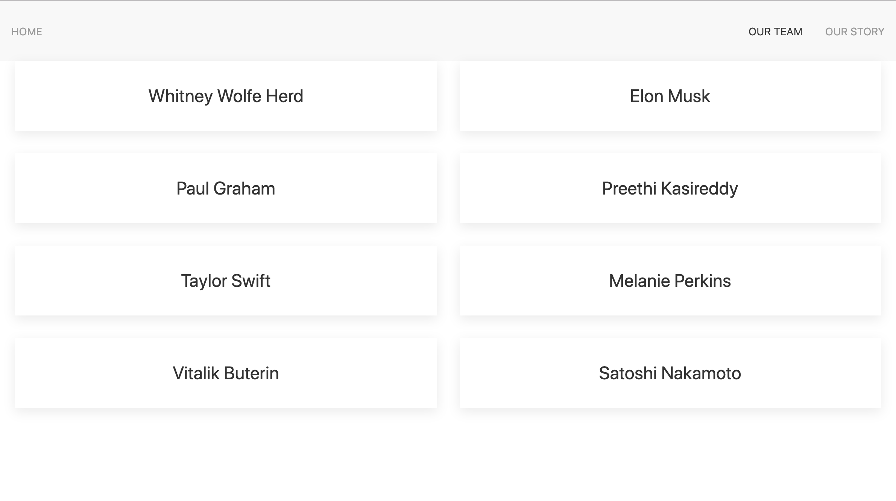
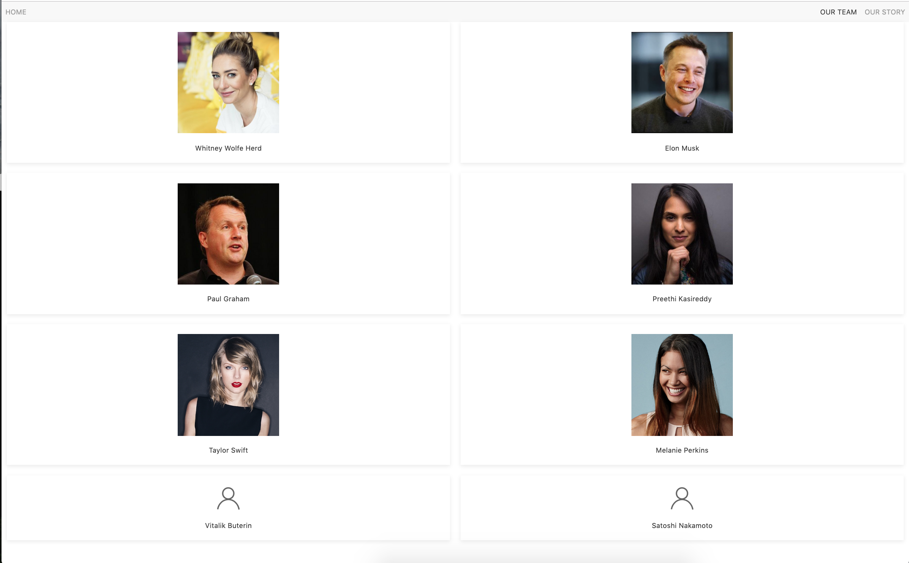
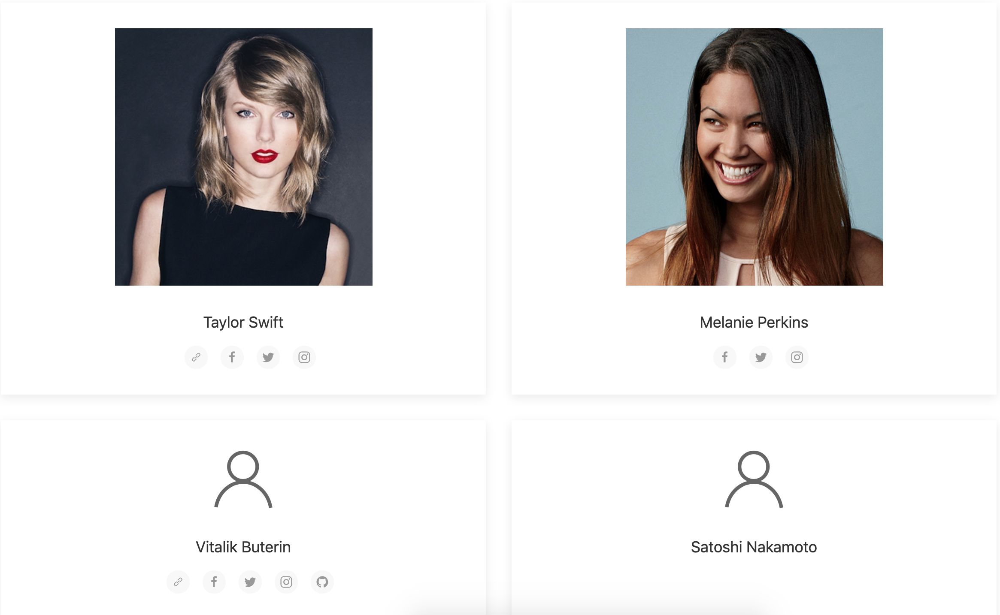

# Combining UIkit and AirTable
> Let's combine [UIkit](https://getuikit.com) and [AirTable](https://airtable.com/) to build a visually appealing website that grabs real data!

### UIkit Setup
---
1. Add a navbar using [UIkit's navbar](https://getuikit.com/docs/navbar). It should look like the image below. The active page should be "Our Team". (The other pages will not exist we are just faking them in the navbar)
    
1. Add a [grid](https://getuikit.com/docs/grid) to your page that looks like this. Add a class called `personContainer` to each card `<div>`. You will use these later.
    
1. Login to your Airtable account and click "Add a base" & "Start from scratch" to create a new database called `famousPeople` that has 8 columns `name`, `title`, `image`, `personalWebsite`, `facebookUrl`, `instagramUrl`, `twitterUrl`, and `githubUrl` . Use the data below to fill your table.
    ```
      {
        name: "Whitney Wolfe Herd", 
        title: "Founder & CEO of Bumble", 
        image: "https://pbs.twimg.com/profile_images/986295682473619458/hdssAuaV_400x400.jpg", 
        personalWebsite: null,
        facebookUrl: null,
        instagramUrl: 'https://www.instagram.com/whitney',
        twitterUrl: 'https://twitter.com/whitwolfeherd',
        githubUrl: null,
      },
      {
        name: "Elon Musk", 
        title: "Founder of SpaceX, Tesla, and The Boring Company", 
        image: "https://shortyawards.imgix.net/entries/9th/23a00ff8-ce44-4cf1-87da-cae409b3ce24.jpeg?auto=format&fit=crop&h=400&q=65&w=400&s=a09f3365cd0cf2b04cd4a172c2ff8c9d",
        facebookUrl: null,
        instagramUrl: 'https://www.instagram.com/elonmusk/',
        twitterUrl: 'https://twitter.com/elonmusk',
        githubUrl: null,
      },
      {
        name: "Paul Graham", 
        title: "Founder of Y Combinator", 
        image: "https://pbs.twimg.com/profile_images/1824002576/pg-railsconf_400x400.jpg", 
        personalWebsite: 'http://www.paulgraham.com',
        facebookUrl: null,
        instagramUrl: null,
        twitterUrl: 'https://twitter.com/paulg',
        githubUrl: null,
      },
       {
        name: "Preethi Kasireddy", 
        title: "Founder & CEO of TruStory", 
        image: "https://bloximages.chicago2.vip.townnews.com/indiawest.com/content/tncms/assets/v3/editorial/3/fc/3fc3385c-7a4f-11e8-b213-ebf7b1959aea/5b33fea628031.image.jpg?resize=400%2C400", 
        personalWebsite: 'https://www.preethikasireddy.com/',
        facebookUrl: 'https://www.facebook.com/preethikasireddy',
        instagramUrl: 'https://www.instagram.com/preethikasireddy/',
        twitterUrl: 'https://twitter.com/iam_preethi',
        githubUrl: 'https://github.com/iam-peekay',
      },
      {
        name: "Taylor Swift", 
        title: "Singer", 
        image: 'http://static.djbooth.net/pics-artist/taylor-swift.jpg', 
        personalWebsite: 'https://www.taylorswift.com/',
        facebookUrl: 'https://www.facebook.com/TaylorSwift',
        instagramUrl: 'https://www.instagram.com/taylorswift/',
        twitterUrl: 'https://twitter.com/taylorswift13',
        githubUrl: null,
      },
      {
        name: "Melanie Perkins", 
        title: "Founder & CEO of Canva", 
        image: 'https://static-t.aa-cdn.net/wp-content/uploads/2018/03/melanie-perkins-2.jpg', 
        personalWebsite: null,
        facebookUrl: 'https://www.facebook.com/melanieperkins87',
        instagramUrl: 'https://www.instagram.com/melaniecanva/',
        twitterUrl: 'https://twitter.com/melaniecanva',
        githubUrl: null,
      },
      {
        name: "Vitalik Buterin", 
        title: "Founder of Ethereum", 
        image: null, 
        personalWebsite: 'https://vitalik.ca/',
        facebookUrl: 'https://www.facebook.com/VitalikButerinCa/',
        instagramUrl: 'https://www.instagram.com/vitalikbuteriin/',
        twitterUrl: 'https://twitter.com/VitalikButerin',
        githubUrl: 'https://github.com/vbuterin',
      },
      {
        name: "Satoshi Nakamoto", 
        title: "Anonymous Creator of Bitcoin", 
        image: null, 
        personalWebsite: null,
        facebookUrl: null,
        instagramUrl: null,
        twitterUrl: null,
        githubUrl: null,
      },
    ```
1. Now set up an `ajax` request in your javascript file to `GET` your famous people data from Airtable. Use `console.log` to make sure your data is being returned properly.
1. Select all of your `peopleContainer`s using jQuery and save them in a variable.
1. Once you have set up your `ajax` request, loop through the data in your response to [`append`](http://api.jquery.com/append/) the `name` of each famous person in an `<h3>` on each card in your grid.
  
1. Now add the image of the person to each grid, if it exists, otherwise, show the [UIkit user icon](https://getuikit.com/docs/icon). *Hint* you can pass [ratio](https://getuikit.com/docs/icon#ratio) to make the icon bigger. Here is an image to follow below (note: the image scale may look different because it is zoomed out).
  

1. Okay, now our goal is to show an icon for each url that is not null. The personalWebsite icon will be a link, and all of the other icons will show. We've written some helpful steps to follow below.
    For example, Preethi Kasireddy would look like this.
    
    And here are some other examples:
    
  - Write a function called something like `createIconButton` that takes in two parameters: a link and an icon name. It should return the HTML needed to create an [icon button link](https://getuikit.com/docs/icon#button-modifier) using UIkit.
  - As your are looping through your data, check for each link type. If the link exists for that person, use your `createIconButton` function to add a button link to their card. 


